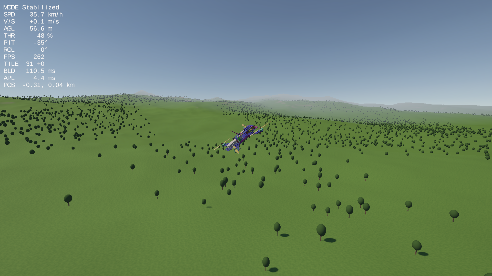
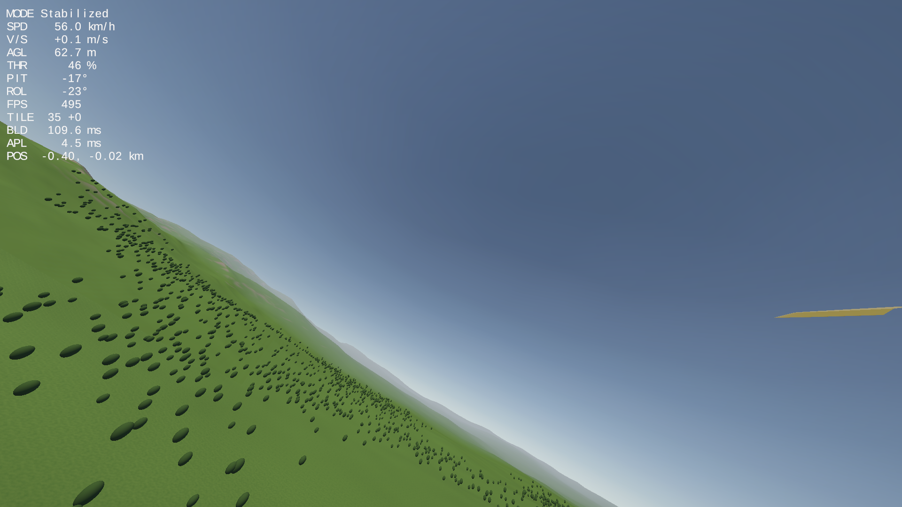

# FlyDrone — прототип польоту дрона (Unity 6, URP)

Квадрокоптер на Rigidbody (тяга, інерція, квадратичний опір повітря, PID-стабілізація) і процедурний світ 8×8 км, який підвантажується тайлами terrain у фонових потоках.

Сцена: `Assets/_Project/Scenes/SampleScene.unity`. Стек: Unity 6 LTS, URP, Input System, Cinemachine 3.

| Chase-камера | FPV-камера |
|---|---|
|  |  |

## Збірка проєкту

Потрібно: **Unity 6000.6.0f1** (Unity 6 LTS) і безкоштовний Unity-акаунт.

1. Клонуйте репозиторій і відкрийте папку в Unity Hub → **Add project from disk**.
2. Додайте асет моделі дрона (див. нижче). Це потрібно зробити один раз на акаунт/машину.
3. Відкрийте сцену `Assets/_Project/Scenes/SampleScene.unity` і натисніть Play, або зберіть через **File → Build Profiles**.

### Сторонні асети

Проєкт використовує модель:

- **PBR Racing Drone** від JackBurfy — <https://assetstore.unity.com/packages/3d/vehicles/air/pbr-racing-drone-59751>

Асет поширюється за [Unity Asset Store EULA](https://unity.com/legal/as-terms): його можна використовувати у своїх проєктах, але **не можна** викладати вихідні файли у відкритий доступ. Тому папки `Assets/PBR Racing Drone/` у репозиторії немає (вона в `.gitignore`), і кожен завантажує асет під власним акаунтом:

1. Відкрийте сторінку асету за посиланням вище, увійдіть і натисніть **Add to My Assets** (асет безкоштовний).
2. В Unity: **Window → Package Manager → My Assets → PBR Racing Drone → Download**. Натискати **Import** не обов'язково.
3. Імпорт відбудеться автоматично. Editor-скрипт [`ThirdPartyAssetImporter`](Assets/_Project/Editor/ThirdPartyAssetImporter.cs) при відкритті проєкту шукає `PBR Racing Drone.unitypackage` у локальному кеші Asset Store і тихо імпортує його. Щоб запустити імпорт одразу, без перезапуску редактора, скористайтеся **Tools → FlyDrone → Import PBR Racing Drone**.

Кеш Asset Store, де скрипт шукає пакет:

| ОС | Шлях |
|---|---|
| Windows | `%AppData%\Unity\Asset Store-5.x\` |
| macOS | `~/Library/Unity/Asset Store-5.x/` |
| Linux | `~/.local/share/unity3d/Asset Store-5.x/` |
| будь-яка | змінна оточення `ASSETSTORE_CACHE_PATH`, якщо кеш перенесено |

Якщо пакета в кеші немає, редактор покаже діалог із посиланням на Asset Store і кнопкою, щоб вказати `.unitypackage` вручну. Пакет зберігає оригінальні GUID, тому `Drone.prefab` після імпорту сам підхоплює меш і матеріали.

**Без асету** проєкт компілюється і запускається: фізика, керування, світ і бенчмарк працюють, лише дрон невидимий. У batch-режимі (CI) скрипт не показує діалог і лише пише попередження в лог. Щоб CI збирав проєкт із моделлю, пакет має бути в кеші Asset Store на машині збірки або в `ASSETSTORE_CACHE_PATH`. Не комітьте пакет у репозиторій і не публікуйте його в артефактах.

> Якщо ви публікуєте форк, не видаляйте `Assets/PBR Racing Drone/` з `.gitignore`.

## Керування

| Дія | Клавіатура | Геймпад |
|---|---|---|
| Тангаж / крен | W S / A D | правий стік |
| Газ | Space / Left Ctrl | лівий стік ↕ |
| Рискання | Q / E | лівий стік ↔ |
| Режим Stabilized ↔ Acro | M | Y / △ |
| Камера chase ↔ FPV | C | X / □ |
| Респаун | R | Start |
| Бенчмарк-проліт | B | — |

- **Stabilized** — стік задає кут нахилу, газ — вертикальну швидкість; відпущені стіки = висіння.
- **Acro** — стік задає швидкість обертання, як у FPV-прошивках; центр газу — висіння.

## Документація

- [ARCHITECTURE.md](ARCHITECTURE.md) — як влаштовані фізика дрона, керування, генерація й стрімінг світу, камери та HUD.
- [BENCHMARK.md](BENCHMARK.md) — методика замірів, що оптимізувалося і результати «до / після».
